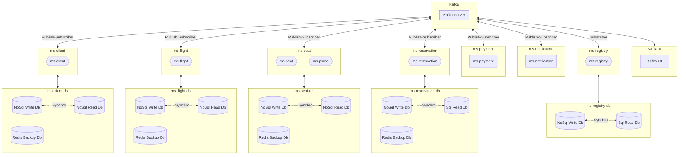

# hex-cqrs-es-eda

Airline management Microservices in a multimodule Maven project with Hexagonal Arch, CQRS, Event Sourcing, Event Driven Arch and Kafka for synchronizing databases

**Components**
- [Kafka](https://kafka.apache.org/) [9092] + [9093] 
- [Kafka-UI](https://docs.kafka-ui.provectus.io/) [8080]
- REST API ms-client with [OpenApi Swagger](https://swagger.io/) and two separate DB for R/RW actions [8081]
- REST API ms-flight with [OpenApi Swagger](https://swagger.io/) and two separate DB for R/RW actions [8082]
- REST API ms-seat with [OpenApi Swagger](https://swagger.io/) and two separate DB for R/RW actions [8083]
- REST API ms-reservation with [OpenApi Swagger](https://swagger.io/) and two separate DB for R/RW actions [8084]
- [Redis](https://redis.io/) DB in every microservice work as caches to store ID references for other REST APIs
- Service ms-payment simulates an event driven payment gateway.
- Service ms-notification working as an event driven notification service
- REST API ms-registry with [OpenApi Swagger](https://swagger.io/) and two separate DB for R/RW actions for storage of all events [8085]



## Table of contents

- [Installation](#installation)
- [Usage](#usage)
- [It's not a bug, it's a feature](#features)
- [Maintainers](#maintainers)
- [License](#license)


## Installation

1. First of all clone or download the project.

1. Inside the main folder, you could find two docker-compose yaml files.

1. From there use the command line to start the project in dev or production mode

```
    **Generate .jar**
    mvn clean package
    
    **Developer mode**  
    docker-compose -f docker-compose-dev.yml up -d

    **Production mode**
    docker-compose -f docker-compose-prod.yml up -d
```
      
The dev environment is ready for using with your IDE. The microservice attempts to communicate with Kafka using the local host. In production, it uses the archive Dockerfile to build an image of the project, so you wont need the IDE.
   
4. You could stop the project and free resources with any of these orders

```
    **Developer mode**
    docker-compose -f docker-compose-dev.yml down --rmi local -v
      
    **Production mode**
    docker-compose -f docker-compose-prod.yml down --rmi local -v  
```
   
## Usage

First of all, please visit the REST API documentation. Replace ${port} for the suitable microservice port:

    http://localhost:${port}/swagger-ui/index.html
    
[Kafka-UI](https://docs.kafka-ui.provectus.io/) allow you to check your [Kafka](https://kafka.apache.org/) server using a practical dashboard, so visit the following url:

    http://localhost:8080
    

## Features

#### :arrow_right: Unit testing for business logic classes using Test Containers for Repositories

#### :arrow_right: Include two docker-compose yaml files for easy change of environment

#### :arrow_right: Hexagonal Architecture following Clean Architecture principle

#### :arrow_right: CQRS pattern with independent databases for Read or RW actions

#### :arrow_right: DB synchronization by Publisher-Subscriber pattern

#### :arrow_right: Redis DB in every microservice work as caches to store ID references for other REST APIs

#### :arrow_right: Event Sourcing for persisting as an ordered sequence of events


## Maintainers

Just me, [Iván](https://github.com/Ivan-Montes) :sweat_smile:


## License

[GPLv3 license](https://choosealicense.com/licenses/gpl-3.0/)


---


[](https://www.java.com/es/)
[](https://https://maven.apache.org/)
[](https://spring.io)
[](https://github.com)
[](https://https://eclipse.org/)
[](https://www.sonarsource.com/products/sonarqube/downloads/)
[](https://www.docker.com/)
[](https://kafka.apache.org/)
[](https://choosealicense.com/licenses/gpl-3.0/)